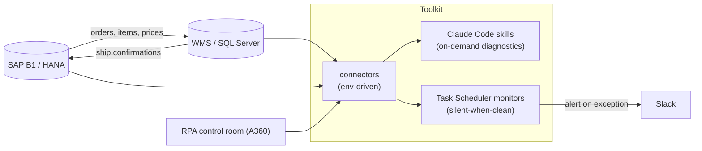

# claude-ops-toolkit

Operations tooling for a multi-region **SAP Business One + WMS** landscape:
recurring integration diagnostics turned into one-command playbooks, and
always-on monitors that stay silent until something actually breaks.

Built around a real ERP↔WMS integration (SAP B1 on HANA ⇄ a HighJump/Accellos-style
WMS on SQL Server) plus an RPA fleet. This is a **sanitized reference version** —
all endpoints, credentials, identifiers, and business data have been removed;
schema/object names shown are vendor-standard.

## Context & my role

I designed, built, and deployed this tooling to run against live production
systems in a multi-region retail/distribution operation. The work took recurring,
manual integration investigations — the kind that previously meant ad-hoc SQL
across two systems every time a ticket landed — and turned them into repeatable
one-command playbooks plus always-on monitors that surface problems before users
report them. In practice it has caught real issues: stranded serialized inventory
blocking ERP receipts, orders that silently failed to reach the warehouse floor,
and price-list propagation gaps that would otherwise ship as blank-priced orders.

This public repository is a sanitized reference of that work — the architecture and
engineering patterns, with all proprietary endpoints, credentials, identifiers, and
data removed.

## Architecture



## What this demonstrates

- **ERP ⇄ WMS integration** — order flow, item/price-list synchronization, inbound
  receipts and outbound deliveries, ship-confirmation backflow, and drift detection
  between two systems of record.
- **WMS operations domain** — waves and allocation, serial/batch-managed inventory,
  inbound/outbound staging (EWM-adjacent concepts).
- **SQL across two engines** — T-SQL (SQL Server) and SAP HANA SQL, including
  set-based reconciliation and defensive read patterns.
- **Python engineering** — env-driven connectors, resilient scheduled jobs, REST
  API integration, clean separation of concerns.
- **Monitoring & observability** — exception-only alerting, tunable thresholds,
  day-over-day deltas, structured logging, Slack delivery.
- **Automation** — Windows Task Scheduler orchestration; Automation Anywhere (A360)
  fleet health via the control-room REST API.
- **AI-assisted operations** — Claude Code skills that encode expert diagnostic
  playbooks so they are repeatable and shareable.

## Two surfaces, one body of logic

Each diagnostic exists as an **on-demand skill** (run it while investigating) and,
where it makes sense, an **unattended monitor** (the same logic on a schedule).

| Area | On-demand skill | Unattended monitor |
|---|---|---|
| WMS order-import failures | `wms-import-errors` | `monitor_wms_import_errors.py` |
| Empty inbound PO (item not synced) | `wms-empty-po` | — |
| ERP ⇄ WMS order-flow drift | `wms-b1-reconcile` | — |
| Regional price-list propagation gap | `so-price-gap` | `monitor_so_price_gap.py` |
| WMS wave / staged-inventory health | `wave-health` | `monitor_wave_health.py` |
| RPA bot-fleet health | `bot-health` | `monitor_bot_health.py` |

## Design principles

- **Silent when clean.** Monitors alert only on genuine exceptions; healthy runs
  log a heartbeat. Signal, not noise.
- **Classify before alarming.** Each check separates benign, expected conditions
  (product-standard lock rejections, non-stockable line items, historical backlog)
  from real failures — the difference between an actionable alert and noise.
- **Read-only by default.** Every check is a SELECT / API read; no writes without
  explicit human action.
- **One logic, two surfaces.** The same check runs interactively and unattended.
- **Secrets never in git.** `.env` is git-ignored; only `.env.example` is committed.

## Repository layout

```
claude-ops-toolkit/
├── connectors/     env-driven connection templates (WMS / ERP / RPA) + .env.example
├── monitors/       Task Scheduler monitor scripts, shared alerting/logging, register script
└── claude-skills/  Claude Code skills (one folder per skill, each a SKILL.md)
```

## Getting started

```bash
pip install -r requirements.txt
cp connectors/.env.example connectors/.env   # fill in your endpoints/credentials
cp monitors/.env.example  monitors/.env      # Slack + thresholds
```
Then register the monitors (Windows): `monitors/register_tasks.ps1`. See each
subdirectory's README for details.
