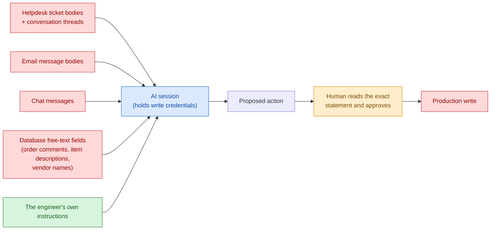

# 02 — Safety Model

An AI with database access is only as trustworthy as the controls around it. This is the layered
model, what each layer actually stops, and the failure modes you should plan for rather than hope
against.

## The layers

No single layer is trusted to be perfect; each assumes the others might fail.

| # | Layer | Mechanism | Enforced by | What it stops |
|---|---|---|---|---|
| 1 | Credential isolation | Secrets in environment variables only; servers **refuse to start** without them | Code | Credential leakage through code sharing; silent hangs on interactive fallback |
| 2 | Zero network surface | Servers are stdio child processes — nothing listens on a port | Architecture | The entire class of network attacks: no endpoint to scan, no auth handshake to break |
| 3 | Account least-privilege | Query-only service accounts on every system that should not be written to | Database grants | Any write, even if every software layer above were compromised |
| 4 | Code gates | Fail-closed statement allowlist on read-only channels | Code | Write attempts before they leave the process |
| 5 | Human gate | Production writes require: exact statement stated → explicit approval → then execute | Working agreement + tool docstrings | Unreviewed production mutation |
| 6 | Post-write verification | Read back after every write; independent monitors watch the aftermath | Practice | Silent partial failures and "it said it worked" errors |
| 7 | Rollback + attribution | Rollback scripts saved *before* the change; every change attributable to a named person | Practice + schema | Unattributable or unrecoverable changes |

### The confirmation rule

The governing rule for write-capable channels, in substance:

1. Before **any** state-changing action, state **exactly** what will change — the statement, the
   path, the variable.
2. Wait for an explicit approval.
3. Only then execute — and read back to verify.

Explicitly exempt, to keep velocity: read-only queries, health checks, creating new local files,
analysis and drafting. The scope test is one question: *does it change live production state?*

This rule is written into the tool docstrings, not just a policy document, for the reason covered
in [01](01-mcp-server-pattern.md): the model re-reads docstrings on every call.

**Be honest about what this layer is.** A confirmation rule is a working agreement, not a
technical control. If you rely on it — and any write-capable setup does — then you should also:

- keep write volume genuinely low, so each approval gets real attention;
- require a `WHERE` clause and an expected row count before approving any UPDATE/DELETE;
- add a database-level audit of writes by the service account, reviewed periodically, so the rule
  is *verifiable* rather than merely asserted;
- consider a **separate least-privilege login for analysis sessions**, reserving the write-capable
  login for explicitly declared change work. This is the single highest-leverage improvement
  available to most setups, because it removes standing write capability from the majority of
  working hours.

---

## Prompt injection and untrusted input

This deserves its own treatment: an AI that reads ticket text, email, chat messages, and free-text
database fields **while holding write credentials** is the most interesting risk in the
architecture.

### Which inputs are untrusted

"Untrusted" does not mean malicious. It means *not authored by the operator directing the session*
— and therefore capable of carrying instruction-shaped text.

The database free-text path is the one teams usually miss. Order comments and item descriptions
arrive from upstream systems and get read during analysis. They are data from a system of record,
but nobody vetted them as prose.

### Where the attack chain breaks

1. Untrusted text contains instruction-shaped content.
2. The model would have to treat it as an instruction rather than as data.
3. The model would then have to propose a write.
4. **A human must read the exact statement and approve it.**
5. Only then does it execute.

Steps 1–3 are model behavior and cannot be guaranteed by architecture. **Step 4 is the control.**
For read-only systems the chain cannot complete at all — there is no write path to be steered
into, regardless of what any text says. This is the strongest argument for making read-only the
default: it removes whole categories of risk rather than mitigating them.

### The weakest link, stated plainly

The realistic failure is not a clever injection. It is **a human approving a plausible-looking
statement without full attention.** Approval quality degrades with volume, familiarity, and time
pressure.

Design accordingly: keep write volume low, make each proposed change small and readable, require a
stated blast radius, and treat a long unbroken streak of approvals as a signal to slow down rather
than as evidence that the process works.

---

## AI failure modes you should expect

Any team claiming their AI has never been wrong is not looking. These are the failure modes worth
designing for, and the mechanism that catches each. **The catch mechanism, not the model's
accuracy, is what makes the system safe.**

| Failure mode | What it looks like | Caught by | Standing mitigation |
|---|---|---|---|
| **Schema hallucination** | Confidently querying a table or column that does not exist | The database — immediate `Invalid object name` error | Free and instant. Read the real structure from the catalog, then proceed. Log recurring traps so the same guess isn't made twice |
| **Unverified figure carried forward** | A number stated once, repeated across documents, never measured | Deliberate measurement passes | Require a stated query behind any number that matters; label estimates as estimates |
| **Stale memory presented as current** | A fact true when written, quoted months later as present tense | A verify-before-acting rule | Re-check against the live system before acting on any recalled fact |
| **Plausible-but-wrong root cause** | A diagnosis that fits the symptom and is still wrong | Testing the hypothesis before acting | Require the diagnosis to explain *why the failure is selective* — not merely correlate with it |
| **Over-broad first fix** | Fixing the symptom's location rather than the defect's location | Human review of the proposal | Scope fixes to the boundary where the defect actually lives |

### What this implies structurally

**Loud failures are safe failures.** Schema hallucination is the most common AI error in this kind
of work and also the most harmless — the database rejects it instantly at zero cost. The dangerous
errors are the *quiet* ones: a plausible root cause, a stale fact, an unverified number. Each
needs its own catch mechanism because none of them announce themselves.

**Verification is not decoration.** Read-back after writes, re-verification of recalled facts, and
stated-query metrics exist precisely because the model is fallible in known, characterized ways.

**Track defects.** If you cannot say how many AI-assisted changes shipped, how many were rolled
back, and how many were later found defective, you do not have a quality signal — you have an
absence of recorded failure, which is not the same thing.

---

## Data handling

- **Read-only by default.** The write-capable channels should be the few that ship fixes.
- **No bulk extraction.** Cap result sets and flag truncation. Analysis pulls samples and
  aggregates, not table dumps.
- **Preserve precision.** Never let quantities or money pass through binary floats.
- **Protect outbound channels structurally.** If an integration reads customer-facing tickets,
  implement only the read endpoints. A create/reply capability that is never used is still a
  capability that can be invoked by accident; one that was never written cannot be.

---

*Next: [03 — Automation pipeline](03-automation-pipeline.md)*
