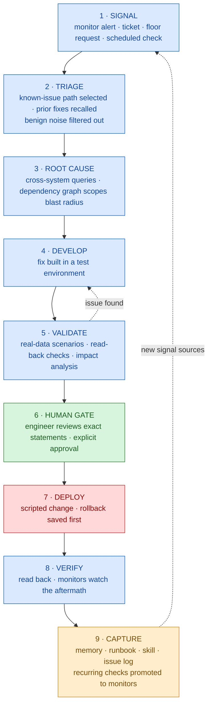

# 03 — The Automation Pipeline

Every automated task — a monitor alert, a support ticket, a floor request, a scheduled check —
moves through the same nine stages. The stages are fixed; what varies by lane is which stages are
automated and which are human.

## The pipeline

Two properties matter more than any individual stage.

**The human gate is structural where it can be.** For database writes it is a standing rule (see
[02](02-safety-model.md)). For some platforms it is physically unavoidable — for example, when a
design database is separate from the runtime, changes only reach users through an explicit
compile-and-activate step that no automation can perform. Where you can make the gate a property
of the architecture rather than a rule people follow, do it.

**Stage 9 is what makes the system compound.** A problem solved once becomes a skill, a runbook, a
memory entry, or a monitor — so the same class of problem is never diagnosed from scratch twice.
The issue log additionally records **dead ends**, so wasted paths are not re-walked. Without stage
9 you have an assistant. With it, you have a system that gets cheaper to operate over time.

---

## The automation lanes

### Lane A — Always-on monitors

Scheduled jobs that watch production continuously and raise alerts. They automate stages 1–2 and
hand off to a human or a skill. Typical set for a warehouse/ERP estate:

| Monitor | Watches for |
|---|---|
| Interface errors | Genuine integration failures, *after* filtering known-benign rejections |
| Work queue health | Stalled batches, and data-integrity mismatches that will block downstream posting |
| Pricing gaps | Orders importing with missing prices because an upstream propagation job lagged |
| Bot fleet health | Failed or timed-out RPA runs, stuck jobs, scheduled bots gone silent |

The design lesson worth stealing: **the filter is the product**. An interface error queue where
99%+ of rows are expected rejections is worse than useless — people stop reading it. Encoding
"which of these are actually real" turns a nine-thousand-row daily wall of noise into a handful of
actionable items, and that single piece of judgment is the difference between a monitor people
trust and one they mute.

### Lane B — Diagnostic skills

A skill is a diagnosis performed manually once, then codified: the queries, the decision points,
the known-benign patterns to filter, the prescription format. They automate stages 2–3 and produce
a recommendation, not an action.

Skills are where hard-won integration facts become executable — the exact join keys between two
systems, the flag that means "this record was exported," the two error messages that are always
noise. Written down in prose, those facts decay. Written into a skill, they run.

### Lane C — AI-assisted development

The main production lane: the AI develops fixes against live schemas, in a test environment first,
promoted after human approval. This is the full nine stages.

### Lane D — Self-healing loop

A structured detect → diagnose → propose → **approve (human)** → execute → verify loop for known
pathologies, with each executed resolution accumulated as a runbook for reuse. The approval step is
what separates this from the "autonomous remediation" pitch that makes operators justifiably
nervous.

### Lane E — Simulation and decision support

Not task automation but *decision* automation: a discrete-event model that answers "what happens to
throughput if we change labor, equipment, or flow" without touching operations.

State its epistemic status honestly. A model parameterized from real operating statistics into a
representative facility is a **directional tool for comparing scenarios** — sound for ranking
options against each other, not for committing capital on an absolute number. Validating against
one real facility's measured output is the prerequisite before it informs an investment decision.
Claiming more than that is how simulation projects lose credibility permanently.

### Lane F — Existing RPA

Pre-existing bot fleets are not replaced but brought under observation. The two layers are
complementary: bots execute fixed keystroke-level procedures; the AI layer handles diagnosis,
development, and anything requiring judgment.

---

## What qualifies for automation

All four should hold:

1. **Recurrence** — it has happened at least twice and will happen again.
2. **Deterministic diagnosis** — the investigation path can be written as queries and decision
   points, not intuition.
3. **Measurable output** — the automation produces something checkable: a classification, a
   prescription, an alert, a validated script.
4. **Bounded blast radius** — read-only, or writes that are scoped, verified, and reversible.

## What should stay manual

| Kept manual | Why |
|---|---|
| Approval of production writes | The control that makes broad AI access survivable |
| Runtime promotion steps | Where a platform gives you a structural gate, keep it |
| Business policy decisions | Judgment calls with cross-department consequences |
| Transaction creation in the system of record | Use the official API when you need it, never direct database writes |
| First response to a novel incident | Automation is extracted from the *second* occurrence, never the first |

That last row is the one teams get wrong most often. A novel failure deserves a human-led
investigation precisely because you do not yet know which parts generalize. Automating from a
sample size of one encodes coincidence as rule.

---

*Next: [04 — Memory architecture](04-memory-architecture.md)*
