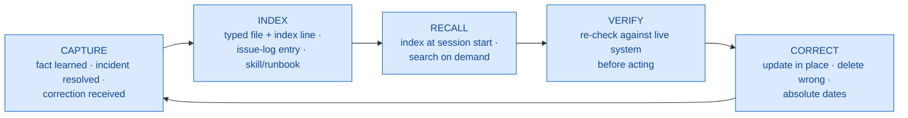

# 04 — Memory Architecture

An AI session starts empty. What makes an AI-assisted operation compound in value is a deliberate
memory architecture: several layers, each holding a different kind of knowledge with a different
lifetime, and a discipline that treats memory as **evidence to be verified** rather than as ground
truth.

## The layers

| # | Layer | Holds | Lifetime | Form |
|---|---|---|---|---|
| 1 | Session context | The current task's working state | One session | Volatile |
| 2 | Persistent facts | Preferences, project state, environment facts, corrections | Until corrected | One file per fact + an index |
| 3 | Operating instructions | Standing rules, conventions, source-of-truth policy | Living document | Markdown loaded every session |
| 4 | Skill library | Procedural memory: codified diagnostic runbooks | Living | One folder per skill |
| 5 | Document search (RAG) | The full operations corpus, searchable | Re-indexable | Hybrid keyword + vector index |
| 6 | Structural memory | The codebase as a dependency graph | Re-indexable snapshot | Graph index |
| 7 | Design archive | Investigation reports that justify decisions | Permanent | Evidence-indexed documents |
| 8 | Issue log | Symptom-indexed troubleshooting entries | Append-only | Single markdown file |

They answer different questions: *what did we decide?* (2, 3) · *how do we diagnose X?* (4) ·
*where did we write about Y?* (5) · *what breaks if I change Z?* (6) · *why is the design this
way?* (7) · *have we hit this error before, and what were the dead ends?* (8).

---

## Layer 2 — persistent facts

This is the layer worth scrutinizing, because it is where staleness risk lives.

**One fact per file, with typed frontmatter:**

```markdown
---
name: interface-error-queue-is-mostly-benign
description: 'E' status rows in the inbound queue are mostly expected lock
  rejections, not failures — filter two known messages to find real errors
metadata:
  type: reference        # one of: user | feedback | project | reference
---

<the fact, with dates made absolute, linked to related memories via [[wiki-links]]>
```

- `user` = who the operator is and how they work · `feedback` = corrections and confirmed
  approaches, **stored with the reasoning** so the rule survives context loss · `project` = ongoing
  work state · `reference` = pointers to external resources.
- A one-line-per-memory index loads at session start; full files load on demand. Recall stays cheap
  without flooding context.

**Curation rules:**

1. **Update, don't duplicate** — check for an existing memory on the topic and revise it in place.
2. **Delete what proves wrong** — when a fact is disproven, rewrite it to say so explicitly rather
   than leaving it to mislead.
3. **Don't store what the system of record already stores** — code structure and version history
   are not duplicated into memory. Memory holds what is *not* derivable: decisions, environment
   facts, preferences.
4. **Absolute dates at write time** — "next week" becomes a date.

### The staleness rule

**A recalled memory is a point-in-time observation, not live state.** Before acting on a memory
that names an object, a flag, or a file, re-verify against the live system.

This is the single most important rule in the memory architecture, and it is what makes aggressive
capture safe. The loop is deliberately asymmetric:

> **Capture is cheap and habitual. Acting on memory is expensive and gated by verification.**

That asymmetry lets memory grow without stale entries becoming production incidents.

**Never store in memory:** credentials, bulk data extracts, or anything that only mattered to one
conversation.

---

## Layer 3 — operating instructions as loaded memory

Each project root carries an instructions file the AI loads every session: the confirmation rule at
the top with override priority, the source-of-truth policy (*live system is authoritative; the
backup file is not*), output format standards, and a **self-updating keyword table** — a standing
rule that when a new shorthand→object mapping is established in conversation, a row gets appended.

This is where team-shareable *behavioral* memory lives. A new engineer inheriting the folder
inherits the rules, not just the code.

---

## Layer 4 — skills as procedural memory

A skill is the graduation target of the pipeline's capture stage: a runbook that fires repeatedly
becomes a skill; a skill whose trigger is predictable becomes a scheduled monitor.

The property that matters: **skills keep verified integration facts executable.** Join keys, flag
semantics, and known-benign patterns are exactly the knowledge that decays fastest in prose and
survives longest in something that runs.

---

## Layers 5–8 — the knowledge stack

**Document search (RAG).** Every operations document indexed for hybrid retrieval — keyword
matching for exact terms like procedure names, vectors for conceptual questions. Standing rule:
*search before re-deriving*.

Three honest caveats most RAG write-ups skip:

- **Retrieval quality is usually unmeasured.** "It returns relevant results in practice" is not
  evidence. Assemble ~20 questions with known-correct source documents and score whether the right
  document comes back.
- **Re-indexing is often manual**, so new documents are invisible to search until someone runs it,
  and superseded documents are not automatically demoted — both old and new versions return.
- **Configuration drifts.** Source roots pointed at moved folders fail silently. Config that
  references paths needs the same verification discipline as memory itself.

There is also a scoping decision worth making deliberately: **decide what does *not* belong in the
corpus.** A knowledge base that indexes everything on a machine will happily surface personal
material in a work search. Excluding it by design keeps the corpus shareable with a teammate.

One trap to know: **removing a source from the config does not remove already-indexed documents.**
Most indexers only prune files that no longer exist on disk. Retiring content means deleting its
rows from the document, chunk, embedding, and full-text tables, then vacuuming the database.

**Structural memory (dependency graph).** The codebase parsed into a call/reference graph and
served as tools. This answers "what is the blast radius of changing this?" — used before changes
and heavily during migration validation. It is a snapshot by nature; structural questions that will
be *acted on* still get confirmed against the live catalog.

**Design archive.** Investigations written as evidence-indexed reports — each ending with the exact
queries run — so a decision made months later can be traced to its observed basis.

**Issue log.** A troubleshooting log with a fixed entry format:

```
## YYYY-MM-DD — <short searchable title>
- Symptom : what it looked like (exact error text where possible)
- Dead end: what wasted time (so it isn't retried)
- Fix     : what actually worked
- Ref     : deeper document, if any
```

Checked **before** diagnosing an unfamiliar error; appended **after** any resolution that took more
than a couple of attempts. Titles are worded to match the actual error text so a future search
hits them.

**The "Dead end" line is the highest-value field** and the one most logs omit. Knowing what did not
work is often worth more than knowing what did, because it prevents the same hour being spent
twice.

---

## The lifecycle



---

## The team dimension

| Asset | Scope | Notes |
|---|---|---|
| Skills, instruction files, design archive, issue log | Files — fully shareable | Copy or version-control as-is; the issue log in particular transfers hard-won trap knowledge on day one |
| Document index | Rebuildable from the shared corpus | A teammate re-indexes locally |
| Dependency graph | Rebuildable per environment | Re-index per target |
| Persistent per-person memory | Individual | Does not auto-transfer — mitigate by pushing durable facts *down* into shareable layers |
| Credentials | Individual by design | Never shared; each person provisions their own least-privilege accounts |

The working principle: ***personal memory is a cache; the shareable layers are the database.***
Anything that matters beyond one person gets written into a layer someone else can load.

---

*Next: [05 — Operating the stack](05-operating-the-stack.md)*
